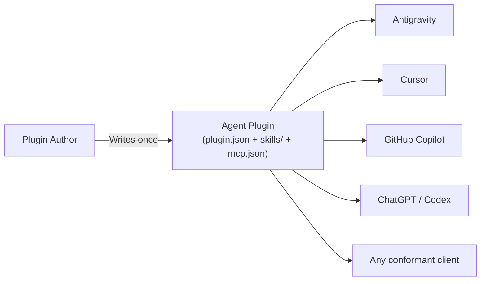
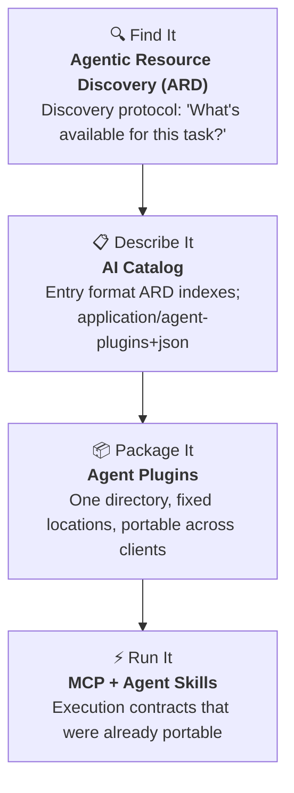

# Agent Plugins: Package reusable agent components into portable and interoperable plugins


In my work with AI coding agents, I have created many skills that help these agents gain domain and procedural knowledge. Some of these skills are paired with scripts, tools, and MCP servers to take actions based on procedural knowledge. When working with coding agents, everyone on the team has preferences. I prefer using Codex and fall back on Devin for all my coding tasks. Other people on my team prefer using VS Code with either the Codex or Devin extension, and someone else prefers good old PyCharm for everything. But we all share the skills and the MCP configurations. Each of these agents has its own way of consuming skills and MCP configurations. AI coding agents and clients (IDEs, CLIs, platforms) each invented their own plugin packaging format. This is even when plugins contained the same underlying components. A developer who built a useful skill + MCP server combination had to:

1. Rearrange the directory layout for each client
2. Rewrite manifest metadata in a different shape
3. Maintain parallel copies that inevitably drifted apart

What's different between different agents and clients is the wrapper around these skills and MCP configurations.

[Agent Plugins](https://agent-plugins.org/) defines a shared manifest (`plugin.json`) and a fixed directory convention so the parts that are the same across clients use one structure. Agent Plugins is a specification, not a framework or a library, that defines a portable directory-based package format for bundling reusable components that extend AI agents. Published as version 1.0.0, it was created by a Technical Steering Committee (TSC) of Core Maintainers from Amazon, Cursor, Google, Microsoft, OpenAI, and Vercel.

> I have written about different agent AI standards in an [earlier article](https://ravichaganti.com/blog/navigating-agent-ai-standards-foundations-protocols-competition-and-path-to-convergence/). It provides an overview and comparison of various existing standards.

The specification standardizes how two already portable technologies, agent skills and MCPs, are packaged together into a single distributable unit.



## Agent plugin anatomy

Similar to how an agent skill is defined, an agent plugin is a directory with a fixed structure.

```
my-plugin/
├── plugin.json              # REQUIRED — Plugin manifest
├── skills/                  # OPTIONAL — Agent Skills
│   └── summarize/
│       ├── SKILL.md         #   Skill instructions (YAML frontmatter + Markdown)
│       ├── scripts/         #   Helper scripts
│       ├── references/      #   Reference documents
│       └── assets/          #   Additional resources
├── mcp.json                 # OPTIONAL — MCP server declarations
├── com.example.client/      # OPTIONAL — Client-specific extension directory
│   └── hooks/
├── LICENSE
└── CHANGELOG.md
```

| Path                  | Required? | Purpose                                                      |
| --------------------- | --------- | ------------------------------------------------------------ |
| `plugin.json`         | **Yes**   | Identifies the plugin; the only required file                |
| `skills/`             | No        | Contains Agent Skills, one subdirectory each                 |
| `mcp.json`            | No        | Declares stdio, Streamable HTTP, or SSE MCP servers          |
| `com.example.client/` | No        | Reverse-domain extension namespace for client-specific features |

> Components are discovered at fixed locations. There is no discovery path to configure and no precedence order to learn. If `skills/` isn't there, the client loads what is there and moves on.

If you have already built agent skills, the `skills/` folder structure is what you are already familiar with. You can place multiple skills in there. The `mcp.json` is used to declare and expose the MCP servers to the clients. 

```json
{
  "$schema": "https://agent-plugins.org/schemas/1.0.0/mcp.schema.json",
  "mcpServers": {
    "local-analyzer": {
      "type": "stdio",
      "command": "./bin/analyzer",
      "args": ["--verbose"],
      "env": {
        "DB_HOST": "${DB_HOST}",
        "LOG_LEVEL": "info"
      },
      "cwd": "${PLUGIN_ROOT}"
    },
    "cloud-api": {
      "type": "streamable-http",
      "url": "https://api.example.com/mcp",
      "headers": {
        "X-Custom-Header": "value"
      }
    }
  }
}
```

All three transport types (`stdio`, `streamble-http`, and `sse`) are supported within the schema. If the configuration specifies any environment variables, the client automatically injects those into the `stdio` server processes. Pay attention to the following rules when adding MCP configuration.

- Never hardcode credentials in `mcp.json` headers. Authentication must be managed by the client.
- All `command` and `cwd` paths starting with `./` must resolve within the plugin root.
- Clients MUST explicitly declare the `type` on every MCP entry. No guessing transport from config shape.

The minimal `plugin.json` manifest shape requires just two fields.

```json
{
  "$schema": "https://agent-plugins.org/schemas/1.0.0/plugin.schema.json",
  "name": "deployment.tools"
}
```

The `plugin.json` [schema is intentionally closed](https://agent-plugins.org/schemas/1.0.0/plugin.schema.json) and strict. The spec needs a way to let each client add its own custom stuff *without* polluting the shared, portable parts of the plugin. The solution? Reverse-domain directories. The folders named like `com.example.client/` that act as private namespaces. Google's blog post describes this as an [escape hatch](https://developers.googleblog.com/agent-plugins-package-your-skills-tools-and-more/) and deserves a detailed discussion.

Imagine you build a `deploy-helper` plugin. The skill and MCP server are portable and work everywhere. But you *also* want to add a keyboard shortcut for Cursor, a pre-deploy hook for Antigravity, and a slash command for Copilot:

```
deploy-helper/
├── plugin.json                    # ← Portable: every client reads this
├── skills/
│   └── deploy/
│       └── SKILL.md               # ← Portable: every client loads this
├── mcp.json                       # ← Portable: every client can run this
│
├── com.anysphere.cursor/          # ← ONLY Cursor looks here
│   └── keybindings.json           #   (Ctrl+Shift+D → run deploy)
│
├── com.google.antigravity/        # ← ONLY Antigravity looks here
│   └── hooks/
│       └── pre-deploy.sh          #   (runs before deployment)
│
└── com.github.copilot/            # ← ONLY Copilot looks here
    └── commands/
        └── deploy-now.yaml        #   (/deploy-now slash command)
```

#### What Each Client Actually Sees

| Client                 | What it loads                                                | What it ignores                                  |
| ---------------------- | ------------------------------------------------------------ | ------------------------------------------------ |
| **Cursor**             | `plugin.json` + `skills/` + `mcp.json` + `com.anysphere.cursor/` | The Antigravity and Copilot folders              |
| **Antigravity**        | `plugin.json` + `skills/` + `mcp.json` + `com.google.antigravity/` | The Cursor and Copilot folders                   |
| **Copilot**            | `plugin.json` + `skills/` + `mcp.json` + `com.github.copilot/` | The Cursor and Antigravity folders               |
| **A brand-new client** | `plugin.json` + `skills/` + `mcp.json`                       | All three extension folders (gracefully ignored) |

Extension namespaces aren't just directories. They also work inside the manifest via the `extensions` field:

```json
{
  "$schema": "https://agent-plugins.org/schemas/1.0.0/plugin.schema.json",
  "name": "deploy-helper",
  "extensions": {
    "com.anysphere.cursor": {
      "showInCommandPalette": true
    },
    "com.google.antigravity": {
      "runHooksBeforeDeploy": true
    }
  }
}
```

Cursor reads its key, Antigravity reads its key, everyone else ignores what they don't recognize. The result is elegant. One plugin, one package, and multiple clients. Each gets their own custom behavior without breaking anyone else. The portable core stays small and predictable because every client-specific feature has its own clearly labeled home that other clients simply skip over. When specifying extensions, you must adhere to certain rules.

| Rule                  | Details                                                      |
| --------------------- | ------------------------------------------------------------ |
| **Naming**            | Must use reverse-domain namespace (e.g., `com.company.product`) |
| **Graceful ignoring** | Clients MUST ignore unrecognized extension namespaces without errors |
| **Ownership**         | Each namespace is owned entirely by one client               |
| **Portability**       | The portable core stays small because non-portable parts have a legitimate place |

## Plugin package containment and security

The specification enforces strict **filesystem containment** rules:

1. All files discovered, read, or executed by a plugin MUST resolve within the plugin root.
2. Symlinks, junctions, and reparse points MAY resolve to targets within the root, but clients MUST reject paths that escape it.
3. Plugin-relative paths MUST begin with `./`.
4. Clients enforce narrowest applicable failure boundary:

| Failure                                   | Client Action                        |
| ----------------------------------------- | ------------------------------------ |
| `plugin.json` doesn't resolve within root | Reject the entire plugin             |
| Fixed component location escapes root     | Treat that component type as invalid |
| A `SKILL.md` escapes root                 | Skip that skill                      |
| MCP `command` or `cwd` escapes root       | Treat that server entry as invalid   |
| Any other path escapes root               | Deny access to that path             |

## Where Plugins Fit

Agent Plugins is one layer in a broader agentic ecosystem. Each layer is independently useful and independently adoptable:



| Layer        | Technology                                                   | Purpose                                                      |
| ------------ | ------------------------------------------------------------ | ------------------------------------------------------------ |
| **Discover** | [Agentic Resource Discovery](https://agenticresourcediscovery.org/) | Ask "what's available?" and get matching resources           |
| **Describe** | [AI Catalog](https://github.com/Agent-Card/ai-catalog)       | Index entry format; treats plugins as first-class resource type |
| **Package**  | **Agent Plugins**                                            | Portable directory structure                                 |
| **Execute**  | MCP + Agent Skills                                           | Runtime protocols                                            |

> You can publish a plugin with no catalog entry, catalog a resource that isn't a plugin, and run skills with no plugin at all. Adopting one never obligates you to the next.

## When to Use (and Not Use) a Plugin

✅ **Use a Plugin When**:
- You have multiple components (skills + MCP servers) that belong together.
- You want to distribute to multiple clients without maintaining separate wrappers.
- You need both instructions (skills) and tool access (MCP) in one package.

❌ **Don't Use a Plugin When**:
- You have a single MCP server for a single client -> use `mcp.json` alone.
- You have a single skill -> ship the skill directory directly.
- You don't need cross-client portability.

## References

- Agent Plugins Homepage: [agent-plugins.org](https://agent-plugins.org/)
- Full Specification: [agent-plugins.org/specification](https://agent-plugins.org/specification)
- Spec Repository: [github.com/agentplugins/agent-plugins-spec](https://github.com/agentplugins/agent-plugins-spec)

