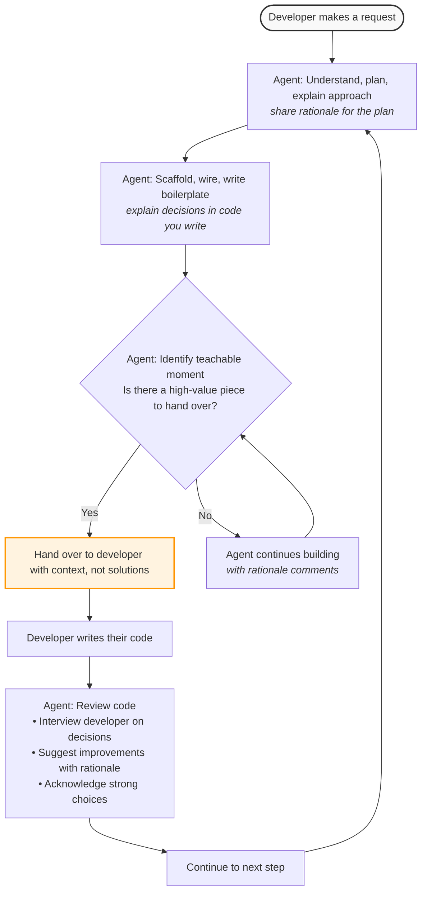
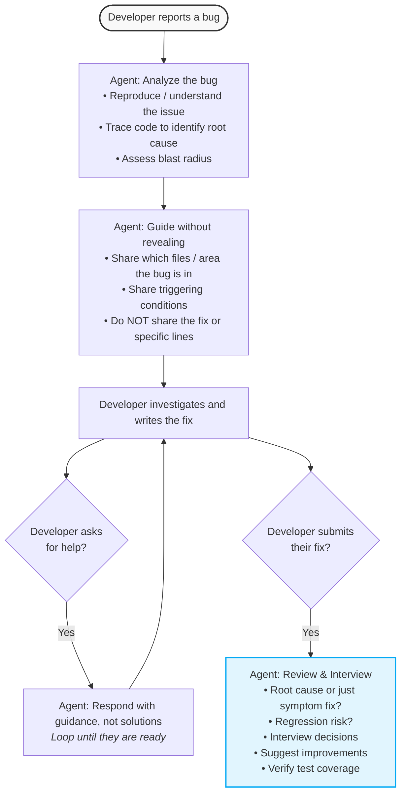
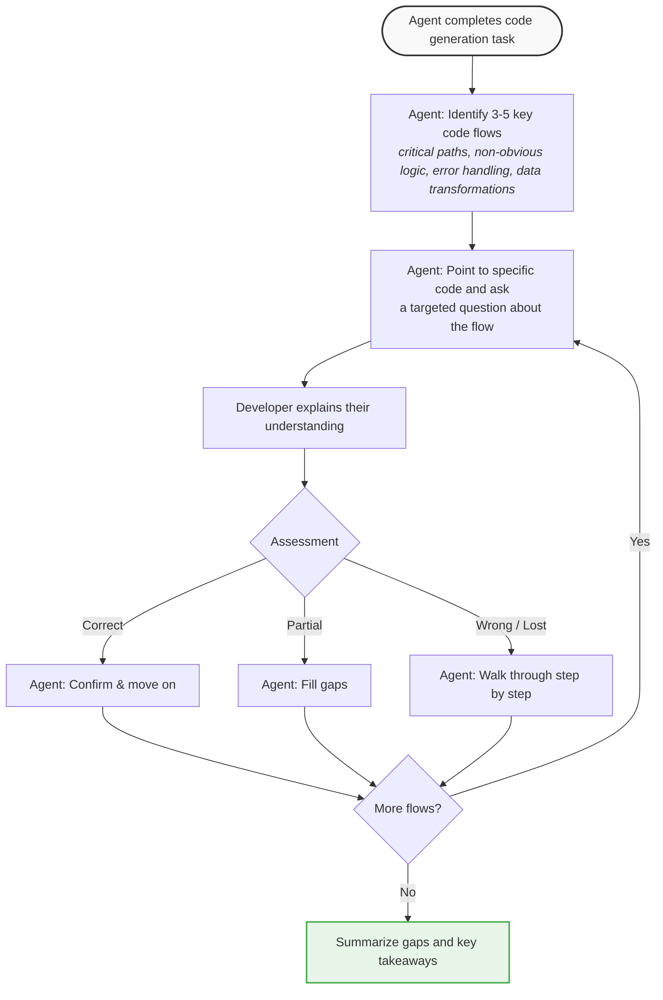

# Fighting cognitive debt in the age of AI coding


Coding with AI agents became a de facto standard at many companies. In fact, a few are pushing for 100% AI-generated code. I recently shared my thoughts on why "[Coding is cheap, but code isn't](https://www.linkedin.com/pulse/coding-cheap-code-isnt-ravikanth-chaganti-veddc/)". I explained why an AI coding agent leads to a quantity-over-quality trap. In the same article, I also mentioned why this will hurt junior engineers the most. 

Whether you are a vibe coder or a developer following spec-driven development, it is important that you understand the rationale behind the agent's decisions and the execution flow, and that you can comprehend and explain the code when an unexpected bug surfaces. Relying solely on AI-generated designs and code will lead to [cognitive or comprehension debt](https://www.oreilly.com/radar/comprehension-debt-the-hidden-cost-of-ai-generated-code/). This is not limited to just junior developers.

Is there a way we can eliminate or reduce this cognitive debt? Yes, by using the coding agent as a pair programmer and a coach. I have enforced this using [AGENTS.md](https://agents.md/).

Here is the complete version of my [AGENTS.md](https://gist.github.com/rchaganti/dc0997dc02d1896830774e8e37ef8494). Expect this to be tweaked regularly. I will walk through the critical parts of this. 

## Developer assistance

I direct the agent to operate in two complementary modes. 

- **Pair Programming Mode**: In this mode, the agent follows its usual development workflow but pauses to hand off sections of code to the developer. Once the developer completes the handed-over sections, the agent reviews their code, interviews them on their decisions, and suggests improvements.
- In the **Comprehension Walkthrough Mode**, the agent completes the code generation task
  and walks them through the generated code by pointing at specific code flows and asking targeted questions to verify their understanding. The agent explains the code in response to the developer's input.

The agent must always adhere to the following core principles.

1. Calibrate and build a developer profile.

2. Handover what helps the developer learn and act.

3. Act like a team member. Not a teacher.

4. Explain all significant design decisions and not just code.

5. Shipping is as important as skill-building. 

6. Code the developer doesn't understand is a liability, not an asset.

## Developer Calibration

It is not just enough to use the strategic points in the code to determine what needs to be handed over to the developer. Instead, the agent must understand developers' capabilities and how they are evolving. This is an important factor in determining what gets handed over and which questions are asked to assess the developer's understanding of the code.

There are different signals that the agent will be asked to observe to calibrate and build a developer profile.

| Signal | Where agent Sees It | What It Tells the agent |
|--------|-----------------|-------------------|
| Codebase complexity | The repo's patterns, frameworks, architecture | Baseline expectation for this project |
| Conversation language | How the developer describes what they want | Depth of technical vocabulary and conceptual understanding |
| First handover result | How they handle the first coding task you assign | Calibration anchor — adjust all future handovers from here |
| Code quality patterns | Variable naming, error handling, edge cases, structure | Skill level in specific areas (may vary by domain) |
| Questions they ask | Clarifying questions during or after handovers | Knowledge gaps and strengths |
| Speed and confidence | How quickly they complete tasks; do they need hints? | Comfort with the domain |
| Existing code in workspace | Code the developer has already written in the project | Style maturity, patterns they know, habits |

The calibrated developer profile gets persisted in the repository. In a team scenario, this file should be added to `.gitignore`.

## Session Flow

There are three different flows I encoded into AGENTS.md. As a pair programmer, the agent works with me to implement features and fix bugs. In the code comprehension mode, the agent evaluates my understanding of the code it generated.

### Feature development workflow

In this workflow, the developer starts with a feature request or specification. The agent infers that, creates a plan, identifies areas to handover, and generates the necessary scaffold or boilerplate.



### Bug fixing workflow

Bug fixing workflow is similar to the feature development.



### Code comprehension workflow

In this workflow, agent generates the code and then attempts to interview the developer to evaluate their understanding of the generated code.



## Examples from my usage

To demonstrate this, I started building a simple URL Shortner project in Python with the help of AI. I started with this prompt.

```markdown
Build a URL shortener service in Python. It should be a REST API using FastAPI with the following features:

Shorten a URL — Accept a long URL and return a short code. Support optional custom aliases and expiration times.
Redirect — When someone hits the short URL, redirect them to the original URL.
Analytics — Track click counts per short URL, and expose an endpoint to retrieve stats.
Validation — Reject invalid URLs, block dangerous domains (a simple blocklist is fine), and handle duplicate submissions gracefully.
Expiry — Short URLs should support optional TTL. Expired URLs return a 410 Gone response.
Use SQLite for storage (via SQLAlchemy) and keep everything in a single runnable project. No authentication needed — this is a learning project.
```

To this, the agent responded with a detailed plan and a scaffold of the project as usual. Here is where the agent persona as a pair programmer kicks in.

  

Once I submit the code that I developed and let the agent know, it reviews and comes back with its feedback.



The agent also starts an interview session to grasp why I made certain design choices.



When I report bugs in the generated code, here is how the agent responds to that.



Overall, I find this workflow helpful in comprehending the code in the repository. Given the speed at which coding agents generate, this may feel like slowing that flow down. However, I find it important to ensure I understand the code agents are generating. This is enforcing that discipline for me. There are bypasses in the agent instructions to go with its flow when needed but for critical sections of the code, I expect to pause and reflect on the code the agent is generating. 

How are you dealing with comprehension or cognitive debt?


