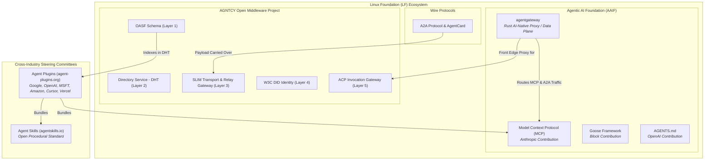
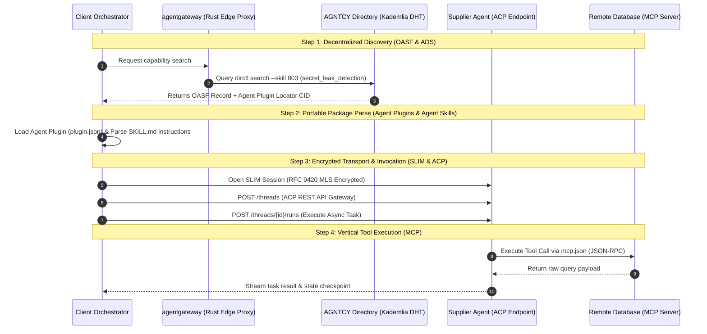

# Navigating Agent AI Standards: Foundations, Protocols, Competition, and Path to Convergence

As an AI and Agentic AI practitioner and enthusiast, I have watched the agentic AI space undergo a massive structural shift over the past year. We have moved rapidly past single LLM prompt wrappers into the era of autonomous, multi-agent systems. However, with this explosive growth has come an inevitable wave of standardizations, acronyms, and governing foundations. If you look at the landscape today, you are confronted with a plethora of open-source initiatives and projects: [Agentic AI Foundation](https://aaif.io/projects), [AGNTCY](https://agntcy.org), Linux Foundation-hosted projects such as [A2A](https://github.com/a2aproject), [BeeAI](https://beeai.dev/), [Agent Skills](https://agentskills.io) by Anthropic, and new entrants like [Agent Plugins](https://agent-plugins.org) by Google.

This, naturally, brings up a few questions:

- Are these standards competing with each other?
- Which ones should my team adopt today?

In this post, I want to step back and provide a clear, practitioner-focused guide to the entire Agentic AI standards ecosystem. We will explore the governing foundations, map out each protocol layer, analyze where they compete versus complement each other, and outline recommendations for how these open initiatives can converge into a unified "Internet of Agents."

## Standards

To make sense of the ecosystem, we must first look at who governs what. Standards in the AI agent world are driven by neutral foundations (primarily the [Linux Foundation](https://linuxfoundation.org)) alongside cross-industry technical steering committees.

### Key Foundations & Alliances
Let us map out the open standards, specifications, and projects hosted under each foundation or driven by key industry vendors.

####  Linux Foundation – Agentic AI Foundation (AAIF)
The **Agentic AI Foundation (AAIF)** was established under the Linux Foundation to host foundational projects for agent tool interaction, developer context, and data plane proxying:
* **Model Context Protocol (MCP):** Donated by Anthropic. A universal standard for connecting AI models to data sources, local files, and external tools (`mcp.json`).
* **Goose:** Donated by Block. An open-source, local-first AI agent execution framework.
* **AGENTS.md:** Donated by OpenAI. A standardized file format providing repository-level instructions to coding agents.
* **agentgateway:** Donated by Solo.io and community maintainers. An open-source, high-performance Rust-based AI-native proxy/gateway built specifically to route MCP, A2A, and LLM inference traffic at the network edge.

#### Linux Foundation – AGNTCY Alliance
I have written about this [earlier as a series of articles](https://ravichaganti.com/series/agntcy/). Donated by Cisco with founding ecosystem partners including Dell Technologies, Google Cloud, Oracle, Red Hat, LangChain, and LlamaIndex, AGNTCY provides a complete horizontal infrastructure stack for multi-agent discovery, encrypted transport, identity, and invocation:
* **OASF (Open Agentic Schema Framework):** A standardized, attribute-based taxonomy separating root actions (skills) from context (domains) with numeric IDs.
* **Agent Directory Service (ADS):** A federated, peer-to-peer Kademlia Distributed Hash Table (DHT) for capability-based agent discovery.
* **SLIM (Secure Low-Latency Interactive Messaging):** High-throughput gRPC transport with RFC 9420 MLS end-to-end encryption and relay gateways.
* **Identity & Trust:** W3C Decentralized Identifiers (DIDs), Verifiable Credentials, and Tool-Based Access Control (TBAC).
* **ACP (Agent Connect Protocol):** An OpenAPI 3.1.1 compliant REST API specification for stateful Thread management and Run execution.

#### Linux Foundation – A2A Protocol
Originally introduced by Google and ecosystem partners, A2A is an open specification for peer-to-peer agent messaging:
* **A2A Wire Protocol:** Defines task lifecycle message envelopes (`AgentRequest`, `AgentResponse`).
* **`AgentCard` Spec:** A JSON metadata descriptor specifying HTTP web service endpoints, supported input/output media modes, and OAuth2 security schemes.

#### Cross-Industry Technical Steering Committees – Agent Plugins
Created by maintainers from Google, OpenAI, Microsoft, Amazon, Cursor, and Vercel:
* **Agent Plugins Specification:** A portable package format (`plugin.json`) that bundles Agent Skills (`skills/SKILL.md`) and MCP servers (`mcp.json`) into a single, vendor-neutral directory structure compatible across different IDEs and agent clients. 

#### Open Community Initiatives – Agent Skills
* **Agent Skills Specification:** A directory format featuring a mandatory `SKILL.md`file (YAML frontmatter + Markdown steps). Uses progressive disclosure so agents scan lightweight metadata at boot and load full instructions/scripts into the context window only when a task matches.

#### Open Knowledge Format (OKF)
Created by Google and available as an open specification, [OKF](https://github.com/GoogleCloudPlatform/knowledge-catalog/blob/main/okf/SPEC.md) provides an open, human, and agent-friendly format for representing knowledge provided to the agent. It is designed to be authored by people, generated by agents, exchanged across organizations, and consumed by both.

## Competing vs. Complementing Dynamics

Are these projects competing, or do they fit together? The answer depends on which part of the stack you examine. When viewed holistically, these standards form a remarkably cohesive operational flow:

1. **Packaging & Tools:** Agent Plugins bundles MCP servers (`mcp.json`) and Agent Skills (`SKILL.md`) into a single portable `.plugin` package.
2. **Discovery & Directory:** **AGNTCY's OASF Schema** indexes the plugin's capability into the Agent Directory Service (ADS) via `dirctl`.
3. **Edge Ingress:** agentgateway proxies incoming network requests at the enterprise perimeter, handling token rate-limiting and TLS termination.
4. **Transport & Invocation:** Traffic routes cleanly into AGNTCY's ACP Invocation Gateway over SLIM RFC 9420 MLS encrypted channels.

Despite this synergy, there are genuine areas of overlap that require coordination:


### 1. A2A Protocol vs. AGNTCY OASF
* **Friction:** A2A's agent card binds metadata directly to an HTTP web service URL. OASF's Record decouples capabilities from endpoints, using global numeric IDs for DHT routing.
* **Impact:** Developers must currently author both an agent card for A2A endpoints and an OASF Record for directory indexing.

<!-- slide -->

### 2. Client Plugin Manifests vs. Agent Plugins
* **Friction:** Historically, IDEs (Cursor, Copilot, VSCode) and agent frameworks (Claude Desktop, LangChain) created custom plugin manifest formats.
* **Impact:** `agent-plugins.org` was formed specifically to eliminate this fragmentation by creating a single shared standard.

<!-- slide -->

### 3. A2A Wire Messages vs. SLIM / ACP
* **Friction:** A2A defines message envelopes over standard HTTP/WebSocket endpoints. AGNTCY provides multi-party pub/sub over SLIM with RFC 9420 MLS encryption and ACP REST thread management.
* **Impact:** Without transport bridges, an A2A agent cannot natively communicate over a SLIM encrypted mesh.


## Recommendations for Convergence

To ensure the multi-agent ecosystem moves toward seamless interoperability rather than fragmentation, I recommend 4 concrete steps for convergence:

1. Allow A2A AgentCard URLs to be referenced as standard locators inside OASF records published to the Agent Directory Service.
2. Formally adopt Agent Plugins bundle CIDs as the primary package locator format inside OASF layer 1 records.
3. Standardize SLIMA2A and configure agentgateway to proxy ACP OpenAPI routes natively.
4. Align AAIF, AGNTCY, agentgateway, and Agent Plugins steering committees around shared taxonomy definitions and validation APIs.

Developers and enterprises implementing autonomous multi-agent systems must understand and carefully evaluate the competing and complementing dynamics of different open standards. How is your team structuring your AI agent stack today? Are you adopting MCP, Agent Plugins, or building on AGNTCY?

