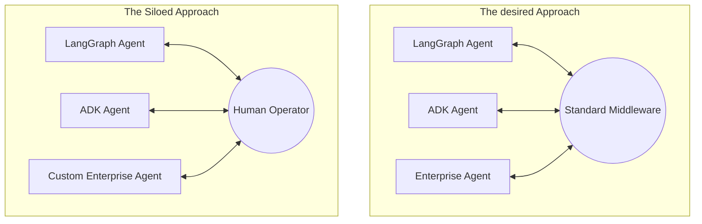

# The Agent silos problem and AGNTCY

As a part of this series, I want to take a step back and examine the current state of AI agents. We have all seen the explosion of powerful agentic frameworks over the last year. If you are building an AI agent today, you might use LangGraph, CrewAI, Google ADK, Microsoft Agent Framework, or any of the dozens of specialized tools out there. Individually, these agents are incredibly capable. They can analyze data, write code, interact with APIs, and summarize vast amounts of information. But there is a fundamental flaw in how we are deploying them. These agents are living in isolation. They are built on different frameworks, hosted in different environments, and speak different dialects. This is the agent silo problem. It is a challenge that, in my experience, is quickly becoming the biggest bottleneck to realizing the true potential of multi-agent systems in the enterprise. 

## Problem in practice

Think about how this manifests in the real world. Let us imagine a modern logistics company handling international freight. They might have a procurement agent built in LangGraph to negotiate shipping rates. Meanwhile, their warehouse operations use an AutoGen-based agent to optimize storage space, and their customs compliance team relies on a specialized agent running on a proprietary enterprise framework.

When a ship is delayed due to weather, the procurement agent knows about the new arrival time. But it cannot directly tell the warehouse agent to adjust its unloading schedule, nor can it alert the compliance agent to prepare documentation for a different port of entry. Instead, a human operator has to read the output from one agent, log into a different dashboard, and feed that information as a prompt to the other agents. We have built brilliant digital workers, but we have placed them in soundproof rooms.

Or consider a manufacturing plant that sources parts from multiple vendors. Vendor A uses an agent to manage inventory levels, while Vendor B has an agent that handles shipping logistics. If the manufacturing plant's internal planning agent wants to coordinate a just-in-time delivery, it has no standardized way to communicate with Vendor A and Vendor B's agents. They are separated by organizational boundaries and incompatible protocols.

## The telephony parallel

When I look at this problem, I am reminded of the early days of telephony. In the late 19th and early 20th centuries, multiple competing telephone companies laid their own wires and built their own exchanges. If you subscribed to Company A, you could only call other subscribers of Company A. To reach someone on Company B's network, you needed a separate phone on your desk connected to their network. It was a fragmented, frustrating experience.

The breakthrough in telephony was not a better telephone; it was standardization. It was the agreement on protocols, switching mechanisms, and interconnectivity that allowed anyone to call anyone else, regardless of their provider. What I recommend we recognize here is that the problem isn't the agents themselves. The agents are excellent. The problem is the infrastructure between them. We need the TCP/IP of the AI agent world.

## Fundamental challenges

To build this connective tissue, we have to solve five specific infrastructure problems. Let us walk through them systematically.

1. **Discovery:** How does Agent A even know Agent B exists? If my logistics agent needs a translation agent, there must be a standardized registry or discovery mechanism to find it, much like DNS for web servers.
2. **Description:** Once Agent A finds Agent B, how does it know what Agent B can do? We need a common format to describe an agent's capabilities, inputs, and outputs—think of this like OpenAPI specs for RESTful services.
3. **Trust:** Is Agent B actually who it claims to be? In enterprise environments, we cannot have agents sharing sensitive data without mutual authentication and authorization protocols.
4. **Communication:** How do they exchange data securely? They need a standardized transport layer and message format to pass context, intent, and results back and forth without losing the nuance of the request.
5. **Orchestration:** How do they coordinate multi-step workflows across different domains? We need a way to manage state, handle failures, and ensure that a complex task involving five different agents actually runs to completion.

## AGNTCY

This is exactly why the AGNTCY project was created. AGNTCY (pronounced 'agency') is a Linux Foundation project dedicated to building the open infrastructure that solves all five of these problems. Let me be clear: AGNTCY is not another framework for building agents. It is the middleware that connects them. I have been reading about and following the [AGNTCY](https://agntcy.org/) project for a while. My employer, Dell Technologies, [has joined the technical steering committee](https://www.dell.com/en-us/blog/dell-drives-open-source-ai-innovation-with-agntcy-linux-foundation/) of this project. This has become even more relevant in my work life.

Originally incubated by Cisco's Outshift team, the project is now backed by major players including Dell, Google Cloud, Oracle, Red Hat, and ecosystem partners like LangChain and LlamaIndex. It provides the standard protocols and routing infrastructure required to let a Google ADK agent seamlessly collaborate with a LangGraph agent, even across organizational boundaries. I think this shift from siloed agents to an interoperable agent network is going to define the next phase of enterprise AI.

In the next part of this series, we will dive deep into the architecture of AGNTCY and look at exactly how it implements this middleware layer under the hood. Have you run into the agent silo problem in your own projects? I would love to hear how you are currently handling inter-agent communication.
