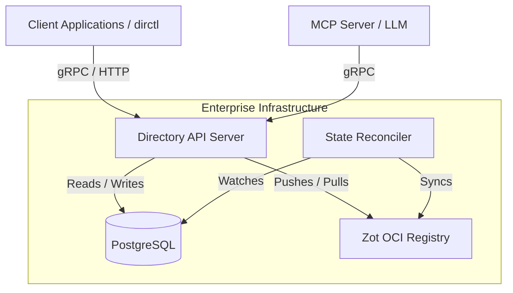

# Understanding AGNTCY - Exposing agent directories via MCP and enterprise deployment


As a part of this series on AGNTCY, we have explored how the Directory acts as the backbone of our agentic networks. In the previous post, we looked at the `dirctl` CLI, the local daemon, and how DHT search works under the hood. Now, it is time to bridge this local capability into the broader AI ecosystem and see how we can run it at an enterprise scale. Let us look at exposing our Directory directly to Large Language Models using the Model Context Protocol (MCP) and deploying the entire stack into a production environment.

## Exposing the Directory via MCP

Think of the Model Context Protocol like a standardized API gateway that LLMs use to reach out into the digital world. Without MCP, an LLM only knows what it was trained on or passed in prompt context. With MCP, it gains active tools. When we connect the AGNTCY Directory to an LLM via MCP, we give the model the ability to query our private registry of specialized agents dynamically during prompt execution.

This is a profound shift. Instead of hardcoding which agent handles which task in our application logic, we can allow a reasoning engine to discover the right tool at runtime. By exposing the Directory to the LLM via MCP, we are giving it a reliable system of reference to verify the existence and credentials of an agent before invoking it.

Let us look at how this is implemented. AGNTCY provides this capability out of the box through `dirctl mcp serve` and the dedicated `dir-mcp` binary. By configuring your LLM environment (like Claude Desktop or Antigravity) with the Directory MCP server, the LLM can invoke searches natively.

Here is what a typical `mcp_config.json` snippet looks like to enable this:

```json
{
  "mcpServers": {
    "agntcy-directory": {
      "command": "dirctl",
      "args": ["mcp", "serve"],
      "env": {
        "DIR_ENDPOINT": "localhost:8888"
      }
    }
  }
}
```

When a user asks their assistant, "Can you analyze the memory dump from the production web server?", the assistant does not need to know how to parse memory dumps. It simply queries the AGNTCY Directory via MCP for "memory dump analysis". The Directory returns the connection details for a specialized debugging agent you registered yesterday. The assistant then hands off the task. This runtime discovery is what I recommend focusing on if you want to build truly resilient, multi-agent systems.

## Native Client SDKs

While MCP is fantastic for direct LLM integration, sometimes we need to orchestrate agent discovery programmatically from within our traditional application code. For this, AGNTCY provides native client SDKs across major languages:

- **Go:** `github.com/agntcy/dir/client`
- **Python:** `agntcy-dir` (available via PyPI)
- **JavaScript / TypeScript:** `agntcy-dir` (available via NPM)

These SDKs abstract away the underlying gRPC and DHT complexities, giving you a clean interface to register, discover, and resolve agent endpoints from your custom frameworks.

## Enterprise Production Deployments

Everything we have discussed so far has assumed a local environment using the daemon with a SQLite backend. While SQLite is perfect for development, a true enterprise deployment requires a different architecture. Moving to production means shifting our state to PostgreSQL for robust relational data and using a Zot OCI Registry to store our agent artifact manifests securely.

Let us look at the deployment options. For a single-node staging environment, the project provides a comprehensive Docker Compose setup under the `install/docker/` directory. This will spin up the API server, PostgreSQL, and the Zot registry in one go. 

However, in my experience, most large-scale deployments target Kubernetes. The AGNTCY team maintains a Helm chart that makes this transition straightforward. You can deploy the entire highly-available stack into your cluster with a single command:

```bash
helm upgrade --install dir oci://ghcr.io/agntcy/dir/helm-charts/dir
```

To visualize how these pieces fit together in a production setting, let us look at the architecture:



The API server acts as the central gateway, interacting with the Postgres database for fast queries while the Reconciler ensures our persistent artifact manifests in the Zot registry remain in sync with the database state. This separation ensures that even if our database goes down, our core registry artifacts remain intact and recoverable.

## Wrapping Up

This wraps up our deep dive into the Directory component. We have moved from understanding the basic concepts to CLI usage, and finally to LLM integration and enterprise deployment. The ability to dynamically discover agents is a fundamental requirement for the systems we are going to build next.

In Week 4, we will introduce the Agent Connect Protocol (ACP). If the Directory is the phonebook, ACP is the telephone line that allows agents to actually speak to one another securely. 

Before we move on, I would love to hear your thoughts. When deploying registries internally, do you prefer running dedicated infrastructure like Harbor or Zot, or do you lean towards managed cloud offerings? Let me know your experiences.

