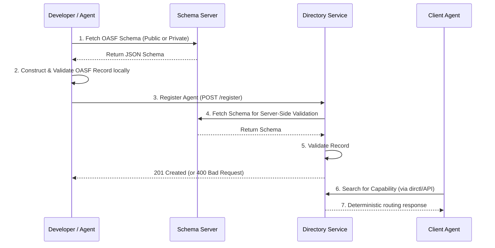

# Understanding AGNTCY - Schema validation and enterprise extensions

As a part of this series on AGNTCY, we have explored the foundational concepts of the Open Agentic Schema Framework (OASF). In Part 4, we looked closely at the OASF Record Object, dissecting how Skills, Domains, and overall capability footprints are structured. Now, let us look at the practical reality of bringing these structures into an enterprise environment. Today, in this short article, we will discuss how these schemas are enforced, extended, and integrated into production networks where failure is not an option.

## The Danger of Unvalidated Metadata

Think of raw JSON as a dynamic typing system—flexible and easy to write, but inherently dangerous if left unchecked in production. In a multi-agent environment, relying on unvalidated metadata is a recipe for disaster. When an agent publishes capabilities with typos in a domain name or missing required fields, it creates "poison knowledge" in your directory. 

Other agents attempting to route tasks based on this flawed metadata will encounter runtime failures. I have seen systems grind to a halt because a simple spelling error cascaded into a routing black hole. Schema validation acts like a strict compiler for agent discovery. It catches these errors before they enter the system, ensuring that what goes into your directory is exactly what other agents expect to find.

## Client and Server-Side Validation

To prevent these 3 AM production debugging sessions, OASF relies on a robust validation model. At the core, we have public schema servers, such as `schema.oasf.outshift.com`, which provide the canonical definitions of the standard. 

When you configure your Directory Service, you can enforce server-side validation using the `DIRECTORY_SERVER_OASF_API_VALIDATION_SCHEMA_URL` environment variable. What I like about this approach is that it shifts the burden of validation from the consumer to the point of entry. By enforcing validation at registration time, the directory outright rejects malformed agent records. We guarantee that any agent successfully registered is fully compliant with the schema, providing a reliable source of truth for the entire network.

## Private Enterprise Schema Extensions

Standard schemas are excellent for general interoperability, but enterprise reality is always more complex. You are rarely just deploying an agent; you are deploying a resource that needs to be tracked by finance, audited by security, and monitored by operations.

This is where private schema extensions become critical. OASF allows you to create custom schemas that inherit from the base definitions. You can mandate that every agent in your organization include a cost center ID, a compliance tier, or internal department tags. Instead of relying on the public internet, you can host these internal OASF schema servers in your private cloud or on-premises environment. I highly recommend this pattern for large organizations. It gives you the flexibility to meet internal governance requirements without breaking the core interoperability that OASF provides.

## Capability-Based Routing and dirctl

Once we have a directory full of strictly validated, perhaps enterprise-extended agent records, we need a way to search them efficiently. Relying on heavy LLM inference to parse and match capabilities for every routing decision is too slow and non-deterministic for enterprise throughput.

Instead, we use capability-based routing. The AGNTCY directory tool, `dirctl`, indexes these OASF taxonomies, allowing for instant, deterministic discovery. Think of it like a highly optimized reverse proxy routing table, but for agent capabilities rather than IP addresses. When a client agent needs a specific skill, it queries the directory, which instantly returns the exact matching agents based on the indexed schema attributes.

Let us visualize how this interaction flows:

## Moving Forward

In my experience, moving from development to production is all about constraints. Schema validation and enterprise extensions provide the necessary guardrails to turn a chaotic swarm of experimental agents into a reliable, enterprise-grade network. 

This wraps up our exploration of the OASF specifications and metadata structures that form the foundation of AGNTCY. In the next part of our series, we will start our deep dive into the Directory Service itself, examining how it handles state, replication, and high availability. 

How does your team currently enforce metadata standards in your internal service catalogs? I would love to hear your thoughts on managing these configurations at scale.

