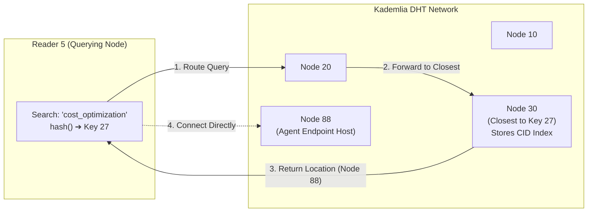

# Understanding AGNTCY - The agent directory service


As a part of this series on AGNTCY, we have explored the core components of the agent lifecycle. In Part 5, we looked at how OASF schema validation ensures that our agents are speaking the same language. After a long gap, today, we shall examine Layer 2 of the AGNTCY architecture: the Agent Directory Service (ADS).

## The Phonebook of Agents

Think of the internet without DNS. It will be a nightmare of IP addresses and static hosts files. In a multi-agent ecosystem, discovery is just as essential. If an agent needs a specific capability—say, querying a specific database or translating text—it needs a way to find another agent that can perform that task.

The Agent Directory Service is the phonebook for our agent ecosystem. However, it is not just mapping a name to an address like DNS does for web servers. Instead, ADS relies on capability-based matching. You do not just ask for "Agent Bob"; you ask the directory, "Who can translate English to French?" and the directory returns the agents that match those capabilities. This decoupling is what makes a multi-agent system truly resilient and scalable.

## Distributed Hash Tables (DHT)

When we talk about a directory service, the immediate thought is often a centralized database—a single point of failure and a massive network bottleneck. The AGNTCY Directory Service takes a fundamentally different approach. It is built on a federated, peer-to-peer architecture using a Kademlia Distributed Hash Table (DHT).

Before we look at the commands, let us make sure we have a crystal-clear understanding of what a DHT actually is and how it works.

### Understanding DHT: The Distributed Card Catalog Analogy

Imagine a massive city library containing millions of books. 

In a **centralized system**, there is a single master card catalog desk at the main entrance. If you want to find a book, everyone stands in one massive line to ask the head librarian. If the head librarian steps out or the catalog desk catches fire, no one in the entire city can find a single book.

In a **Distributed Hash Table (DHT)**, imagine 100 readers scattered across the city who agree to form a book-finding network. 

1. Every reader in the city is assigned a **Node ID** (e.g., Reader 10, Reader 20, Reader 30, up to Reader 100).
2. Every book title is run through a mathematical hashing function to produce a **Key ID** (e.g., `hash("Cloud Security Audit")` -> `Key 27`).
3. The rule is simple: **The reader whose ID is mathematically closest to the Key ID is responsible for holding the index card for that book.** Therefore, Reader 30 stores the location card for `Key 27`.

Now, suppose Reader 5 wants to find "Cloud Security Audit" (`Key 27`). Reader 5 does not ask everyone in the city, nor do they ask a central desk. Reader 5 looks at their small local contact list, sees that Reader 30 is closest to `Key 27`, and asks Reader 30 directly. Reader 30 replies: *"That book is located on Shelf 4 at Node 88."*



### Step-by-Step Numerical Example in AGNTCY

Let us see how this exact mechanism works when an agent registers and another agent discovers it in AGNTCY:

1. **Step 1: Record Hashing (Generating Key ID)**  
   When an agent publishes its OASF capability (e.g., `skill: cost_optimization`, `domain: cloud_infrastructure`), `dirctl` hashes the content to create a **Content Identifier (CID)**—for example, `CID: 0x4F` (integer 79).

2. **Step 2: Distance Metric (Kademlia XOR Distance)**  
   Kademlia measures the "distance" between any node ID and key ID using a simple Bitwise XOR ($\oplus$) operation:
   $$\text{Distance} = \text{Node ID} \oplus \text{Key ID}$$
   The DHT node whose ID yields the smallest XOR result is assigned to store the record index.

3. **Step 3: Logarithmic Routing O(log N)**  
   When a client queries the network for `skill: cost_optimization`, the query jumps through intermediate nodes logarithmically. Even in a network of 1,000,000 active nodes, any agent record can be located in roughly $\log_2(1,000,000) \approx 20$ hops or fewer.

4. **Step 4: Tamper-Proof Resolution**  
   Because the record is retrieved via its cryptographic hash (CID), if a malicious node attempts to alter the agent's endpoint or capability data, the hash check fails instantly.

What I like about this design is that there is no central gatekeeper dictating who can register or query. The network itself maintains the state, making it highly resilient to node failures, network partitions, and censorship.

## Getting Hands-On with dirctl

Let us get started with some hands-on exploration. To interact with the Agent Directory Service, we use a command-line tool called `dirctl`.  You can build this CLI by cloning the repo and manually building it or by downloading the compiled binary from the [repository](https://github.com/agntcy/dir).

First, we can build `dirctl` directly from source on Windows:

```powershell
# Navigate to the CLI directory and compile
cd c:\GitHub\agntcy\dir\cli
go build -o ../dirctl.exe .

# Verify the binary build
cd c:\GitHub\agntcy\dir
.\dirctl.exe --help
```

Next, we start the local daemon. For local development, we can run this with an embedded SQLite backend and a local OCI store to keep things simple:

```powershell
.\dirctl.exe daemon start
```
*Output:*
```
...
level=INFO msg="Server starting" component=server address=localhost:8888
level=INFO msg="HTTP gateway started" component=gateway address=:8889
level=INFO msg="HTTP gateway serving" component=gateway address=:8889
level=INFO msg="Server started" component=daemon address=localhost:8888
...
```

With the daemon running, we can push an agent record to the directory. This record contains the agent's capabilities and its endpoint:

```powershell
.\dirctl.exe push .\record.json --server-addr=localhost:8888
Pushed record with CID: baeareihlajnj64sivcsppoprfp2bpgy4vszmbzx3a22l6mv3txy6pcdrd4
```
Now, the real magic happens when we want to find an agent. We can use the `search` command to query by capability:

```powershell
.\dirctl.exe search --skill "security_privacy/secret_leak_detection" --server-addr=localhost:8888
Record CIDs found: [baeareihlajnj64sivcsppoprfp2bpgy4vszmbzx3a22l6mv3txy6pcdrd4]
```
What I like about this workflow is how seamless it makes agent discovery. The daemon handles the complexities of the DHT, while `dirctl` provides a clean, familiar interface for developers.

## Looking Ahead

The Agent Directory Service is a fundamental building block for scalable, autonomous agent networks. By moving away from centralized registries to a federated DHT, we build systems that are robust and decentralized.

In Part 7, we will explore how to integrate the Model Context Protocol (MCP) into our agents and look at enterprise deployment strategies for AGNTCY. 

Before we get there, I am curious—what agent discovery mechanisms have you experimented with in your own projects? Do you prefer centralized registries or distributed approaches? Let me know in the comments.

