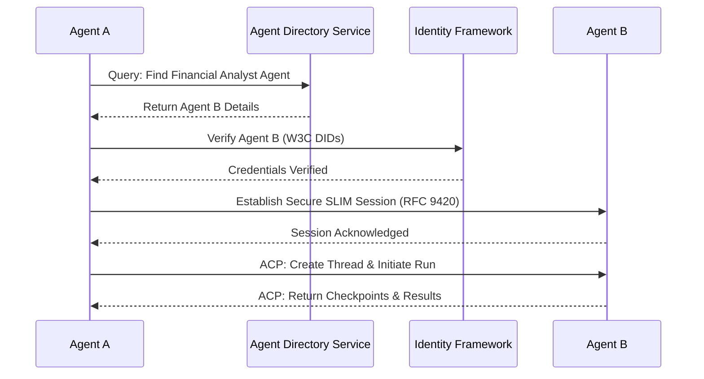
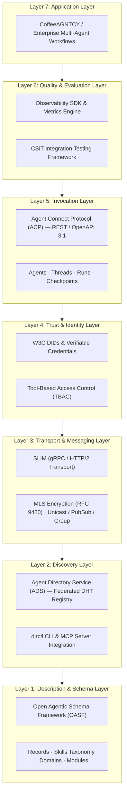

# Understanding AGNTCY - The architecture of the internet of agents

In the previous part of this series, we looked at the fundamental problem of agent silos. We discussed how modern AI agents are brilliant in isolation but struggle to collaborate across different platforms, and we identified the five core problems that need to be solved to build a true Internet of Agents. If you missed it, I highly recommend reading that piece first to understand the *why* before we dive into the *how*. Now, let us look at how AGNTCY actually solves these problems through its layered architecture. 

Building a global network of agents is not a trivial undertaking. It requires a robust, standardized foundation. Much like the OSI model formalized how computers communicate across networks, AGNTCY introduces a structured stack to handle everything from discovery to secure invocation. Let us break down this architecture layer by layer.

## The Open Agentic Schema Framework (OASF)
Before two agents can work together, they need a shared understanding of what each one is capable of doing. Think of this like the WSDL files of the old SOAP days, or more accurately, the OpenAPI specifications we use for REST services today. In AGNTCY, this is handled by the Open Agentic Schema Framework (OASF). 

OASF provides a standardized way for agents to describe themselves. It defines records that include the skills an agent possesses, the domains it operates within, and the modules it exposes. Without this universal description language, agents are essentially speaking in foreign tongues. What I like about OASF is that it forces developers to think rigorously about an agent's boundaries and capabilities. It is the curriculum vitae of the agent world, ensuring that when an agent advertises a capability, the broader network understands exactly what is being offered.

## The Agent Directory Service
Once agents can describe themselves, they need a place to be found. This brings us to the Agent Directory Service. You can think of this as a DNS for agents, but much more powerful. Instead of just resolving a name to an address, it allows for capability-based routing. 

The directory is built as a decentralized, federated registry using Distributed Hash Tables (DHT). This means there is no single point of failure and no central authority acting as a gatekeeper. You can query the network saying, "find me an agent that specializes in optimizing supply chain logistics." The service is accessible via a CLI tool called `dirctl`, as well as native SDKs for Go, Python, and JavaScript. In my experience, having an MCP server integration right out of the box makes it incredibly easy to wire up existing development environments to this vast registry of capabilities.

## The Agent Connect Protocol (ACP)
Finding an agent is only half the battle. We also need a standardized way to talk to it. The Agent Connect Protocol (ACP) is the REST API standard for invoking agents within the AGNTCY ecosystem. Defined using OpenAPI 3.1.1, ACP provides a consistent interface regardless of the underlying agent implementation.

The protocol revolves around a clean data model comprising Agents, Threads, Runs, and Checkpoints. Let us look at this more closely. Think of a Thread as the persistent context of a conversation—much like a long-running chat session or a stateful workspace. A Run, on the other hand, is a specific execution or task within that Thread. If a Thread is a dedicated meeting room for a project, a Run is a specific working session where a distinct task is accomplished. This separation of state and execution allows for complex, multi-step workflows that can pause, resume, and checkpoint their progress seamlessly.

## SLIM Messaging
For agents to collaborate securely across the public internet, they cannot rely on plain, unencrypted HTTP. The stakes are too high when autonomous systems are sharing potentially sensitive data. This is where the SLIM messaging layer comes in. 

SLIM is the secure transport layer built on top of gRPC and HTTP/2. It uses a rigorous four-part naming convention (organization, namespace, service, and client hash) to ensure precise routing. Whether you need point-to-point communication, publish/subscribe patterns, or real-time streaming, SLIM handles it all. More importantly, it mandates end-to-end encryption using the Messaging Layer Security (MLS) standard, specifically RFC 9420. This guarantees that even if the transport network is compromised, the actual payload remains completely opaque to anyone except the intended recipient.

## The Identity Framework
Trust is the bedrock of any decentralized system. AGNTCY handles this through a robust Identity Framework based on W3C Decentralized Identifiers (DIDs) and Verifiable Credentials. 

Instead of relying on a centralized identity provider, agents prove who they are and what they are authorized to do through cryptographic signatures. This is paired with Tool-Based Access Control (TBAC), which governs exactly which operations an agent is permitted to execute. It is a brilliant approach because it removes the need for a central clearinghouse, drawing on the ancient principle of distributed trust that we see in classical systems of trade and verification.

## Observability and CSIT
When you have multiple agents interacting asynchronously, debugging becomes an absolute nightmare without proper telemetry. AGNTCY provides comprehensive observability tools, including metrics and evaluation SDKs specifically designed for multi-agent workflows. 

Furthermore, the ecosystem includes CSIT (Continuous System Integration Testing), which allows developers to simulate and test complex agent interactions before they go live. I highly recommend embedding these SDKs early in your development cycle. Trying to untangle a multi-agent deadlock without proper traces is an experience you want to avoid.

## Putting It All Together
To truly understand how this architecture functions, we need to see it in motion. Let us trace a complete interaction between two agents across the entire stack.

Suppose Agent A (a data aggregator) needs the services of Agent B (a financial analysis specialist). First, Agent A queries the Agent Directory Service to discover an agent with the right capabilities. Once Agent B is found, Agent A verifies Agent B's identity and credentials using the W3C DIDs. Satisfied with the verification, Agent A establishes a secure, end-to-end encrypted SLIM session. Finally, Agent A creates a new Thread and initiates a Run via the Agent Connect Protocol to pass the data and request the analysis.

Here is a visual representation of this flow:

## The Layered Model
When we step back and look at the complete picture, we can see that AGNTCY is built on a structured 7-layer architecture stack. Much like how the OSI model gave us a common framework to understand computer networking from physical cables up to application protocols, AGNTCY structures agentic infrastructure into clear, decoupled layers. Let us examine the architecture diagram below to see how these layers stack from bottom to top:

Let us walk through what happens at each level of this stack:

1. **Layer 1: Description (OASF)** — The foundation of the stack. Standardizes how an agent expresses its capabilities, skills, domains, and data contracts using the Open Agentic Schema Framework.
2. **Layer 2: Discovery (Directory Service)** — The lookup layer. Registers OASF records into a federated DHT network so agents can be discovered based on their declared capabilities.
3. **Layer 3: Transport (SLIM)** — The secure network layer. Handles routing across nodes using 4-part names (`org/namespace/service/clientHash`) and provides end-to-end MLS encryption for point-to-point, pub/sub, and group channels.
4. **Layer 4: Trust (Identity)** — The security layer. Authenticates agent provenance via W3C DIDs and Verifiable Credentials, enforcing Tool-Based Access Control (TBAC) policies before execution.
5. **Layer 5: Invocation (ACP)** — The API layer. Exposes standardized REST endpoints for creating Threads, initiating Runs, and checkpointing progress across agent runs.
6. **Layer 6: Quality (Observability & CSIT)** — The telemetry and validation layer. Collects traces, evaluates output quality metrics, and validates workflow execution via continuous integration testing.
7. **Layer 7: Application** — The business logic layer. Where multi-agent applications (like CoffeeAGNTCY or custom enterprise workflows) orchestrate domain-specific outcomes.

This separation of concerns is what makes the framework so resilient and adaptable. You can swap out transport layers, plug in custom identity providers, or introduce new schema extensions without breaking the layers above or below.

## Looking Ahead

We have covered a lot of ground today, exploring the deep technical underpinnings that make AGNTCY a viable platform for the Internet of Agents. Understanding these layers is crucial for anyone looking to build robust, interoperable autonomous systems.

In the final part of this series, we will look at how AGNTCY compares to the rest of the ecosystem. We will examine other frameworks and see where AGNTCY fits into the broader landscape of AI development. 

What layer of the AGNTCY architecture do you find the most challenging to implement in your current projects? I would love to hear your thoughts on how decentralized identity and capability discovery are shaping your approach to agentic systems.
