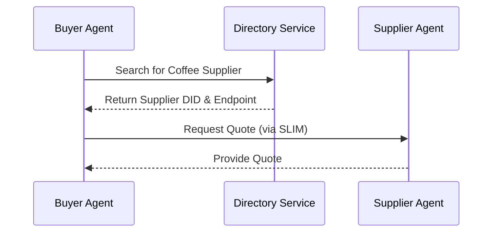
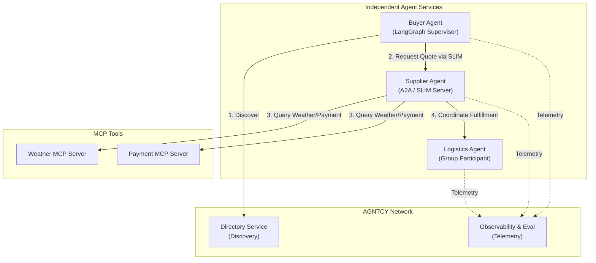

# Understanding AGNTCY - Where it fits in the agentic AI ecosystem

As a part of this series on AGNTCY, we have explored the core components of the platform and the problems it solves. In this third and final post, we need to address the elephant in the room. The AI agent ecosystem is crowded with acronyms — MCP, A2A, ACP, LangGraph, CrewAI, ADK. It is genuinely confusing. I hear this from practitioners constantly. Everyone is building an "agent standard," so how do we make sense of it all? Let us sort it out.

## The Agent Building Frameworks

Let us start with tools like LangGraph, CrewAI, AutoGen, LlamaIndex, and Semantic Kernel. These are frameworks designed for building individual agents. They manage internal logic, reasoning chains, state, and local tool usage.

Think of these like programming languages or application frameworks—Spring Boot for Java, or Next.js for React. They are fantastic at answering the question, "How do I build a smart, capable agent?" What they do not answer is, "How do agents built in different frameworks, residing in different trust domains, securely discover and collaborate with each other?" An agent written in CrewAI has no native way to discover an AutoGen agent on another network, let alone negotiate a secure communication channel.

## MCP: The Vertical Integration

Anthropic introduced the Model Context Protocol (MCP) to standardize how agents connect to data sources and tools. I like to think of MCP as the USB port for AI agents. Before USB, we had serial ports, parallel ports, and proprietary connectors. USB standardized how peripherals connect to your computer.

MCP does exactly this for agents and their tools. It connects an agent vertically to its environment. However, a USB port does not help your computer talk to a server across the globe. MCP is brilliant for local tool integration, but it does not address broad discovery, verifiable identity, or complex agent-to-agent communication over networks.

## A2A: The Messaging Format

Google's Agent-to-Agent (A2A) protocol defines a wire format for agent messaging and task lifecycles. It specifies how to structure a request and a response.

To draw another analogy, think of A2A as the envelope format in the postal system. It tells you where to write the return address and where to place the stamp. But an envelope format alone does not build the postal system. A2A does not include distributed registries for finding agents, decentralized identity for proving who sent the message, encrypted group channels, or observability across networks. It is a crucial piece of the puzzle, but it is not the entire infrastructure.

## AGNTCY: The Infrastructure Stack

This brings us to AGNTCY. AGNTCY is not a single protocol; it is the system of systems.

Consider how the internet works. You do not just use HTTP. You use DNS to find the server, TCP/IP to route the packets, TLS to secure the connection, and HTTP to format the request. You need all of them working in concert. AGNTCY provides this full infrastructure stack for agents. It gives us OASF for standardizing schemas, the Directory for discovery, ACP for capability negotiation, SLIM for secure messaging, Identity for trust, and Observability for tracking what happens.

Classical Indian philosophy often speaks of *Samanvaya*, the harmonization of different systems of thought into a cohesive whole. AGNTCY does this for the agent ecosystem. It provides the cohesive infrastructure that allows diverse agents to interact securely and meaningfully.

## How They Work Together

The crucial insight here is that these technologies are not competitors. They are layers in a stack.

You *build* your agents with frameworks like LangGraph or AutoGen. You *equip* them with tools and data using MCP. And you *connect* them to the wider world using AGNTCY.

In fact, these systems interoperate beautifully. AGNTCY can carry A2A-formatted messages over its SLIM transport layer. The AGNTCY Directory can expose its records as MCP servers, allowing local agents to query the global directory using tools they already understand.

## Ecosystem Comparison

Let us look at a side-by-side comparison to clarify the boundaries.

| Feature                 | Agent Frameworks (e.g., CrewAI) | MCP                           | A2A                             | AGNTCY                                                    |
| :---------------------- | :------------------------------ | :---------------------------- | :------------------------------ | :-------------------------------------------------------- |
| **Primary Scope**       | Internal agent logic & state    | Tool & data source connection | Message format & task lifecycle | Full agent infrastructure stack                           |
| **Discovery**           | None / Local only               | Local tool discovery          | None                            | Distributed global directory                              |
| **Identity & Trust**    | None                            | Client-Server trust           | Assumed / Out of scope          | Decentralized Identifiers (DIDs) & Verifiable Credentials |
| **Messaging**           | Internal state management       | Request/Response              | Point-to-point task messaging   | Multi-transport, end-to-end encrypted                     |
| **Group Communication** | Framework-specific              | None                          | None                            | Pub/Sub & Encrypted group channels                        |
| **Observability**       | Single agent tracing            | None                          | None                            | Cross-agent distributed tracing                           |

## The CoffeeAGNTCY Reference Implementation

To demonstrate how all these pieces fit together, we built CoffeeAGNTCY, a reference implementation modeling a fictitious coffee supply chain. It shows multiple independent agents discovering and communicating securely.

We provide two distinct demos.

The first is the **Corto Demo**. This is the minimal implementation showing just two agents interacting, designed to help developers understand the core mechanics without overwhelming complexity.

The second is the **Lungo Demo**. This is the full-featured, enterprise-scale implementation. It incorporates pub/sub mechanics, group communication, cryptographic identity verification, MCP tool usage, and full observability across the network.

## Getting Started

If you are ready to build, I recommend starting with these resources:

*   **Documentation:** [docs.agntcy.org](https://docs.agntcy.org/)
*   **Code:** [github.com/agntcy](https://github.com/agntcy) (over 50 repositories covering different aspects of the stack)
*   **OASF Browser:** [schema.oasf.outshift.com](https://schema.oasf.outshift.com/)
*   **ACP Spec Viewer:** [spec.acp.agntcy.org](https://spec.acp.agntcy.org/)
*   **Community:** Join the AGNTCY Slack workspace or check out our YouTube channel for deep dives.

## Closing Thoughts

Over the course of this series, we have examined the fundamental challenges of multi-agent systems, unpacked the core components of the AGNTCY architecture, and now mapped how it fits into the broader ecosystem.

We are moving past the era of isolated AI demos and into the era of interconnected, autonomous systems. Just as the internet required a robust, standardized infrastructure to scale, the agentic web requires the same. AGNTCY is building that foundation.

What integration layer do you see as the biggest hurdle in your current agent projects? I would love to hear your thoughts.

